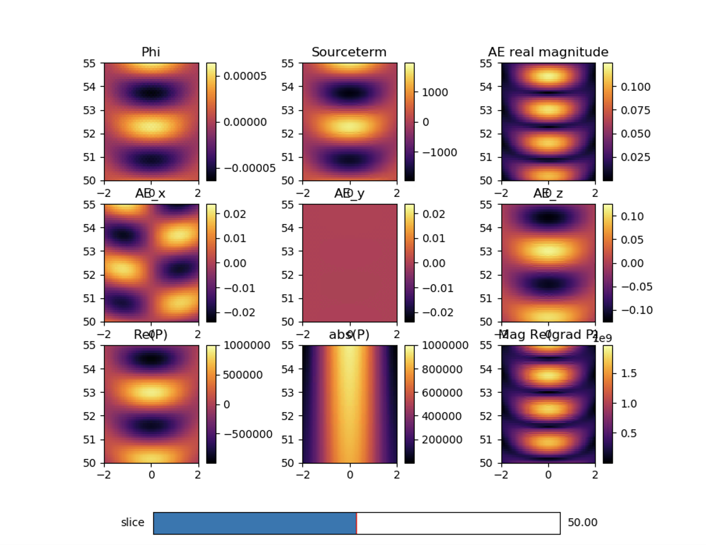

# Acoustoelectric

Herein lies code to support the figures and findings in the Acoustoelectric article. The data that goes with the code in this repository is located in Figshare and referenced in the associated data_locations.txt file. Before running the code, you will need to download the data files and place them in the folders that run the code that pertains to them. 


<p align="center">
	
</p>


## Installation Note

```
Python 3.7.9 
```

To run the code supplied with the figures, Python and associated scientific computing libraries will need to be installed according to:

```
pip install -r requirements.txt
```

## Homogeneous Acoustoelectric Simulation
Fourier(k-space) Poisson solution for the Acoustoelectric effect. 
Please see the article supplementary section for full derivation, with the simulation described in methods. To solve the homogeneous solution of the equation: 

$$
\nabla E_{AE} = E_{0} \beta \cdot \nabla P
$$

we consider the Laplacian of the potential (since $E_{0} = - \nabla \phi$) and consider the right hand side as a source term for the Poisson diffusion equation:

$$
\Delta \phi_{AE} = E_{0} \beta \cdot \nabla P
$$

1. Generate the acoustic field using focused.m. This will save out a two dimensional transducer data file such as large_Area_0.5MHz.mat. 

2. Run python pressure_3Diser.py with the file that was generated. This will put the 2D result into a 3 dimensional grid, utilizing the axial symmetry. 

3. Run python kspace_solver.py to create all the ae components. 

4. To view the simulation, you may wish to use the data viewing gui provided in Fig1and2-simulation_viewer_tool. 

5. If you wish to plot the phasors, run the plot_phi_phasors.py file over the simulation output file. 

<p align="center">
	
</p>


## Figure 1 and 2: Simulation results 

Data to run with this code is included here: DOI: 10.6084/m9.figshare.21802165

```
python plot_viewer.py
```

Will plot the static 2D field, giving you a scroll bar to search through the 3rd dimension in either XY or XZ views. 

<p align="center">
	
</p>


## Figure 3: Acoustoelectric Frequency Mixing in phantom

An example python script is provided which reads in the supplied data recordings, and makes the plots which are contained in Figure 3 of the article. 

## Figure 4: Acoustoelectric 2D maps in phantom 


## Figure 5: Acoustoelectric demodulation and signal recovery in phantom 


## License 

The Creative Commons Attribution-NonCommercial-ShareAlike 4.0 International License seems to fit best with this project. Basically your'e liable to keep any derivative works open, and if you want to do a private fork for a commercial application please contact us. Check out the human readable summary here: 

<a rel="license" href="http://creativecommons.org/licenses/by-nc-sa/4.0/"></a><br />This work is licensed under a <a rel="license" href="http://creativecommons.org/licenses/by-nc-sa/4.0/">Creative Commons Attribution-NonCommercial-ShareAlike 4.0 International License</a>.

If you'd like to make a derivative of this project in a commercial setting, we'd love a payment in exchange for a commercial license so that we can afford to spend time maintaining this project and making more projects like this one. 


