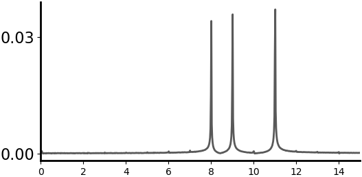

# Acoustoelectric

Herein lies code to support the figures and findings in the Acoustoelectric article. The data that goes with the code in this repository is located in Figshare and referenced in this readme. Before running the code, you will need to download the data files and place them in the folders that run the code that pertains to them. 

Screenshots of the expected outputs are provided, as is Python, Matplotlib, Scipy and Numpy versions used. 

To see all the files uploaded for this project see DOI: 10.6084/m9.figshare.c.6365098

## Installation Note

```
Python 3.7.9 
```

To run the code supplied with the figures, Python and associated scientific computing libraries will need to be installed according to:

```
pip install -r requirements.txt
```

## Homogeneous Acoustoelectric Simulation
Fourier(k-space) Poisson solution for the Acoustoelectric effect. 
Please see the article supplementary section for full derivation, with the simulation described in methods. To solve the homogeneous solution of the equation: 

$$
\nabla E_{AE} = E_{0} \beta \cdot \nabla P
$$

we consider the Laplacian of the potential (since $E_{0} = - \nabla \phi$) and consider the right hand side as a source term for the Poisson diffusion equation:

$$
\Delta \phi_{AE} = E_{0} \beta \cdot \nabla P
$$

1. Generate the acoustic field in matlab using focused.m. This will save out a two dimensional transducer data file such as large_Area_0.5MHz.mat. This implementation was written by Prof. Robin Cleveland. 

2. Run python pressure_3Diser.py with the file that was generated above. This will put the 2D result into a 3 dimensional grid, utilizing the axial symmetry. 

3. Run python kspace_solver.py to create all the ae components. A resultant NPZ file will be created which contains final acoustoelectric fields as well as intermediary results. 

4. To view the simulation, use the data viewing gui provided in Fig1and2-simulation_viewer_tool. 

5. If you wish to plot the phasors, run the plot_phi_phasors.py file over the simulation output file. 

<p align="center">
	
</p>


## Figure 1 and 2: Simulation results 

Data to run with this code is included here: DOI: 10.6084/m9.figshare.21802165

```
python plot_viewer.py
```

Will plot the static 2D field, giving you a scroll bar to search through the 3rd dimension in either XY or XZ views. The viewer shows every variable in the equation simultaneously, to assist in understanding how the acoustoelectrically generated field changes. i.e. the reader may wish to see how the X,Y,Z acoustoelectric field components trend with pressure, or how the potential $\phi$ changes with the gradient of pressure term. 

<p align="left">
	
	
</p>

## Figure 3: Acoustoelectric Frequency Mixing in phantom

Data to run with this code is included here: DOI: 10.6084/m9.figshare.21802171

```
python plot_fmixing_df10hz.py
```
or 

```
python plot_fmixing_df492khz.py
```
Note: You should ensure the filename matches the file you downloaded. 

An example python script is provided which reads in the supplied data recordings, and makes the plots which are contained in Figure 3 of the article. 

Below are some of the outputs of the scripts, showing the frequency mixing nature of the generated acoustoelectric field, the first where the applied eletric field is 8khz, the second where the applied electric field is at 499.99khz. 

<p align="left">
	
	
</p>


## Figure 4: Acoustoelectric 2D maps in phantom 

Data to run with this code is included here: DOI: 10.6084/m9.figshare.21802183


```
python time_scroller_xy_2d.py
```

The python viewing tools contained here enable the reader to scroll through the time series potential data of the generated acoustoelectric field, and observe how it changes with time, as well as how it changes based on the angle between the applied electric field and pressure field. There are a few different tools provided to explore the large files that are provided. 

You can use the arrow keys to scroll through the data, or the slider bar, or enter a specific index in the file you are interested in. This provides a more intuitive way to understand how the acoustoelectric field, based on experimental phantom measurements, changes with time. 

<p align="center">
	
</p>


<p align="center">
	
	
</p>


## Figure 5: Acoustoelectric demodulation and signal recovery in phantom 

Data to run with this code is included here: DOI: 10.6084/m9.figshare.21802174

```
python demodulation.py
```
Note: ensure the filename matches the one that you downloaded. 

This code provides a data set where a complex ionic signal is created in the phantom (8khz + 9khz + 11khz), is upmodulated via the applied ultrasound, and then decoded using IQ demodulation. The code is supplied for this, as is the calculation of the cross-correlation metric. 

<p align="center">
	
	
	
</p>

<p align="center">
	
	
	
</p>

## License 

The Creative Commons Attribution-NonCommercial-ShareAlike 4.0 International License seems to fit best with this project. Basically your'e liable to keep any derivative works open, and if you want to do a private fork for a commercial application please contact us. Check out the human readable summary here: 

<a rel="license" href="http://creativecommons.org/licenses/by-nc-sa/4.0/"></a><br />This work is licensed under a <a rel="license" href="http://creativecommons.org/licenses/by-nc-sa/4.0/">Creative Commons Attribution-NonCommercial-ShareAlike 4.0 International License</a>.

If you'd like to make a derivative of this project in a commercial setting, we'd love a payment in exchange for a commercial license so that we can afford to spend time maintaining this project and making more projects like this one. 


